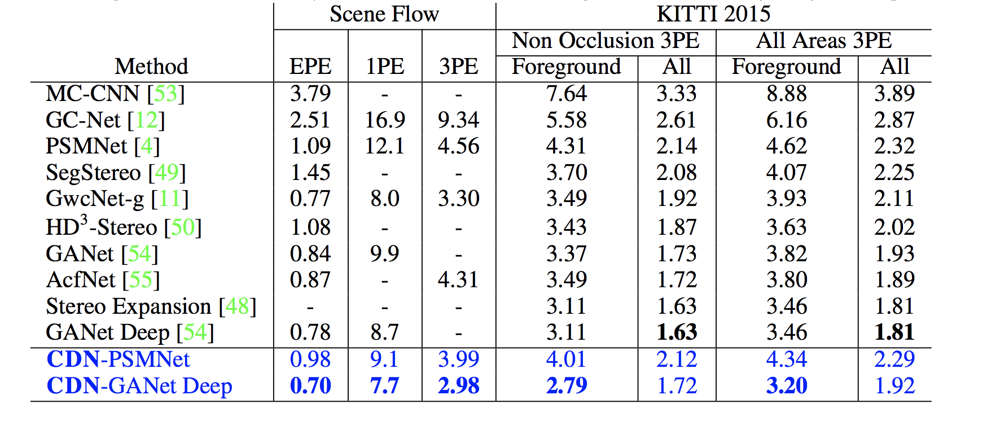
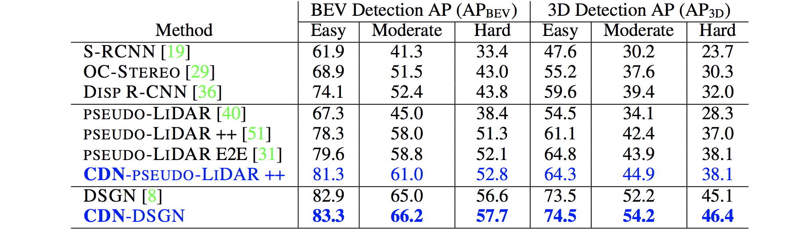

# Wasserstein Distances for Stereo Disparity Estimation

Accepted in NeurIPS 2020 as Spotlight.

[Wasserstein Distances for Stereo Disparity Estimation](https://arxiv.org/abs/2007.03085)

by [Divyansh Garg](https://divyanshgarg.com), [Yan Wang](https://www.cs.cornell.edu/~yanwang/), [Bharath Hariharan](http://home.bharathh.info/), [Mark Campbell](https://campbell.mae.cornell.edu/), [Kilian Q. Weinberger](http://kilian.cs.cornell.edu/) and [Wei-Lun Chao](http://www-scf.usc.edu/~weilunc/)


### Citation
```
@inproceedings{div2020wstereo,
  title={Wasserstein Distances for Stereo Disparity Estimation},
  author={Garg, Divyansh and Wang, Yan and Hariharan, Bharath and Campbell, Mark and Weinberger, Kilian and Chao, Wei-Lun},
  booktitle={NeurIPS},
  year={2020}
}
```

### Introduction
Existing approaches to depth or disparity estimation output a distribution over a
set of pre-defined discrete values. This leads to inaccurate results when the true
depth or disparity does not match any of these values. The fact that this distribution
is usually learned indirectly through a regression loss causes further problems in
ambiguous regions around object boundaries. We address these issues using a new
neural network architecture that is capable of outputting arbitrary depth values,
and a new loss function that is derived from the Wasserstein distance between
the true and the predicted distributions. We validate our approach on a variety
of tasks, including stereo disparity and depth estimation, and the downstream 3D
object detection. Our approach drastically reduces the error in ambiguous regions,
especially around object boundaries that greatly affect the localization of objects in
3D, achieving the state-of-the-art in 3D object detection for autonomous driving.

## Contents

We release the code for CDN-PSMNet and CDN-SDN models.

- [Requirements](#requirements)
- [Pretrained Models](#pretrained-models)
- [Training and Inference](#training-and-inference)

## Requirements
1. Python 3.7
2. Pytorch 1.2.0+
3. CUDA
4. `pip install -r ./requirements.txt`
5. [SceneFlow](https://lmb.informatik.uni-freiburg.de/resources/datasets/SceneFlowDatasets.en.html)
5. [KITTI](http://www.cvlibs.net/datasets/kitti/eval_object.php?obj_benchmark=3d)

## Pretrained Models
TO BE ADDED.

## Datasets
You have to download the [SceneFlow](https://lmb.informatik.uni-freiburg.de/resources/datasets/SceneFlowDatasets.en.html) and [KITTI](http://www.cvlibs.net/datasets/kitti/eval_object.php?obj_benchmark=3d) datasets. The structures of the datasets are shown in below. 

#### SceneFlow Dataset Structure
```
SceneFlow
    | monkaa
        | frames_cleanpass
        | disparity
    | driving
        | frames_cleanpass
        | disparity
    | flyingthings3d
        | frames_cleanpass 
        | disparity
```
#### KITTI Object Detection Dataset Structure
```
KITTI
    | training
        | calib
        | image_2
        | image_3
        | velodyne
    | testing
        | calib
        | image_2
        | image_3
```
Generate soft-links of SceneFlow Datasets. The results will be saved in `./sceneflow` folder. Please change to fakepath `path-to-SceneFlow` to the SceneFlow dataset location before running the script.
```bash
python sceneflow.py --path path-to-SceneFlow --force
```

Convert the KITTI velodyne ground truths to depth maps. Please change to fakepath `path-to-KITTI` to the SceneFlow dataset location before running the script.
```bash
python ./src/preprocess/generate_depth_map.py --data_path path-to-KITTI/ --split_file ./split/trainval.txt
```

Optionally download [KITTI2015](http://www.cvlibs.net/datasets/kitti/eval_scene_flow.php?benchmark=stereo) datasets for evaluating stereo disparity models.

## Training and Inference
- [1 Train CDN from Scratch on SceneFlow Dataset](#1-train-sDNet-from-scratch-on-sceneflow-dataset)
- [2 Train CDN on KITTI Dataset](#2-train-sdnet-on-kitti-dataset)
- [3 Generate Predictions](#3-generate-predictions)
- [4 Train 3D Detection with Pseudo-LiDAR](#7-train-3d-detection-with-pseudo-lidar)

We have provided all pretrained models [Pretrained Models](#pretrained-models). If you only want to generate the predictions, you can directly go to step [3](#3-generate-predictions). 

The default setting requires four gpus to train. You can use smaller batch sizes which are `btrain` and `bval`, if you don't have enough gpus. 

We provide code for both stereo disparity and stereo depth models.

#### 1 Train CDN-SDN from Scratch on SceneFlow Dataset
```bash
python ./src/main_depth.py -c src/configs/sceneflow_w1.config
```
The checkpoints are saved in `./results/stack_sceneflow_w1/`.

Follow same procedure to train stereo disparity model, but use `src/main_disp.py` and change to a disparity config.

#### 2 Train CDN-SDN on KITTI Dataset
```bash
python ./src/main_depth.py -c src/configs/kitti_w1.config \
    --pretrain ./results/sceneflow_w1/checkpoint.pth.tar --dataset  path-to-KITTI/training/
```
Before running, please change the fakepath `path-to-KITTI/` to the correct one. `--pretrain` is the path to the  pretrained model on SceneFlow. The training results are saved in `./results/kitti_w1_train`.

If you are working on evaluating CDN on KITTI testing set, you might want to train CDN on *training+validation* sets. The training results will be saved in `./results/sdn_kitti_trainval`.
```bash
python ./src/main_depth.py -c src/configs/kitti_w1.config \
    --pretrain ./results/sceneflow_w1/checkpoint.pth.tar \
    --dataset  path-to-KITTI/training/ --split_train ./split/trainval.txt \
    --save_path ./results/sdn_kitti_trainval

The disparity models can also be trained on KITTI2015 datasets using `src/kitti2015_w1_disp.config`.

#### 3 Generate Predictions
Please change the fakepath `path-to-KITTI`. Moreover, if you use the our provided checkpoint, please modify the value of `--resume` to the checkpoint location. 

* a. Using the model trained on KITTI training set, and generating predictions on training + validation sets.
```bash
python ./src/main_depth.py -c src/configs/kitti_w1.config \
    --resume ./results/sdn_kitti_train/checkpoint.pth.tar --datapath  path-to-KITTI/training/ \
    --data_list ./split/trainval.txt --generate_depth_map --data_tag trainval
``` 
The results will be saved in `./results/sdn_kitti_train/depth_maps_trainval/`.

* b. Using the model trained on KITTI training + validation set, and generating predictions on testing sets. You will use them when you want to submit your results to the leaderboard.

The results will be saved in `./results/sdn_kitti_trainval_set/depth_maps_trainval/`.
```bash
# testing sets
python ./src/main.py -c src/configs/kitti_w1.config \
    --resume ./results/sdn_kitti_trainval/checkpoint.pth.tar --datapath  path-to-KITTI/testing/ \
    --data_list=./split/test.txt --generate_depth_map --data_tag test
``` 
The results will be saved in `./results/sdn_kitti_trainval/depth_maps_test/`.

#### 7 Train 3D Detection with Pseudo-LiDAR
For training 3D object detection models, follow step 4 and after in the Pseudo-LiDAR_V2 repo https://github.com/mileyan/Pseudo_Lidar_V2.

## Results

### Results on the Stereo Disparity


### Results on the Stereo 3D Object Detection


## Questions
Please feel free to email us if you have any questions. 

Divyansh Garg [dg595@cornell.edu](mailto:dg595@cornell.edu?subject=[GitHub]%20W-Stereo_Disp)
Yan Wang [yw763@cornell.edu](mailto:yw763@cornell.edu?subject=[GitHub]%20W-Stereo_Disp)
Wei-Lun Chao [weilunchao760414@gmail.com](mailto:weilunchao760414@gmail.com?subject=[GitHub]%20W-Stereo_Disp)